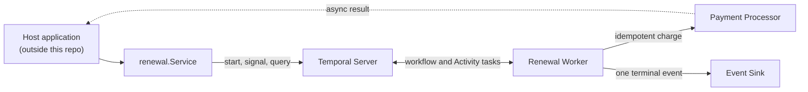

# Subscription Renewal with Temporal

A focused Go implementation of one subscription renewal per patient billing cycle. Temporal owns the durable workflow state, asynchronous payment results, dunning timers, plan changes, cancellation, and the final paid-or-cancelled decision.

## Run

The fresh-clone path needs only **Git and Go 1.25.4 or newer**:

```bash
git clone https://github.com/marcossnikel/futurhealth-renewal-takehome.git
cd futurhealth-renewal-takehome
go test ./...
```

Tests use Temporal's in-process environment and the real Activities with recording adapters. They do not require a Temporal server, Temporal CLI, Docker, Bash, `curl`, `jq`, `nc`, or `seq`. Initial module and checker downloads require network access.

To run a real local workflow and inspect its history in Temporal UI:

```bash
go run ./cmd/demo
```

This one command downloads and caches the pinned official Temporal CLI on first use, then starts an ephemeral server, UI, worker, and a **decline → plan change during backoff → retry → success** scenario. It prints a direct workflow URL and keeps the UI open until `Ctrl+C`; nothing is installed globally. The first run requires network access.

To watch the main workflow scenarios with their Activity and Signal traces:

```bash
go test -count=1 -run '^TestRenewalWorkflow' -v ./pkg/renewal
```

Optional Make targets:

```bash
make setup  # download project modules and the pinned workflow checker
make test   # run the test suite
make check  # formatting, vet, race tests, and workflow determinism
```

`make` is only a convenience; it is not required. `cmd/worker` is the standalone worker for an already-running Temporal server at `localhost:7233`; the self-contained UI demo does not use it.

## How it works

This submission uses the workflow-orchestration option from the exercise. Signals represent asynchronous processor callbacks; durable timers represent dunning backoff and the overall resolution window; Activities isolate external side effects.



The host transport or webhook adapter is intentionally omitted. A caller uses `renewal.Service` to start a workflow, send payment, plan-change, or cancellation Signals, query status, and await the result.

Core behavior:

- The initial charge is submitted immediately; payment completes only after a `payment_result` Signal.
- Failure schedules the next durable retry. `maxAttempts = len(RetryDelays) + 1`.
- A plan change affects the next attempt, never one already submitted.
- Cancellation stops backoff; the absolute deadline resolves an otherwise unfinished renewal.
- Terminal state is write-once and emits exactly one logical `PaymentEvent` or `CancellationEvent`.
- Inputs visible in one workflow task have an explicit priority: **success > cancel > failure > timeout**.

The default policy is three attempts (`1s`, then `2s` backoff) inside a `12s` resolution window. The validated policy is copied into workflow input so running renewals do not change when process configuration changes.

## Code map

| Path | Purpose |
|---|---|
| `pkg/renewal/contract.go` | Inputs, Signals, events, policy, and validation |
| `pkg/renewal/workflow.go` | Temporal orchestration, timers, and conflict ordering |
| `pkg/renewal/domain.go` | State transitions and terminal invariants |
| `pkg/renewal/activities.go` | Payment-processor and event-sink ports |
| `pkg/renewal/client.go` | Caller-facing Temporal service |
| `pkg/renewal/registration.go` | Shared worker registration |
| `pkg/renewal/*_test.go` | Domain, client, and workflow behavior |
| `internal/simulated/adapters.go` | In-memory processor and sink adapters |
| `cmd/demo/main.go` | One-command real-server and UI scenario |
| `cmd/worker/main.go` | Worker and Activity registration |

## Correctness and tests

Stable IDs protect every retryable boundary: patient plus billing cycle for workflow start, workflow plus attempt number for charge submission, processor transaction ID for payment results, and workflow plus resolution for the terminal event.

The suite covers every requested scenario: first-attempt success; retry then success; exhausted retries; duplicate, conflicting, out-of-order, and late results; plan change between attempts; cancellation during backoff; and unresolved timeout. It also covers malformed Signals, Activity acknowledgement loss, idempotent event retries, terminal write-once behavior, custom policies, stable workflow IDs, and client translation.

## Assumptions

- For a valid processor transaction ID, the first payload is authoritative; later exact or conflicting payloads are ignored.
- Only one charge attempt is unresolved at a time. Because the supplied result has no attempt or provider event ID, some delayed same-amount results cannot be correlated safely after a retry starts.
- Plan changes have no command ID or version; the latest valid amount received before the next attempt is used.

## Trade-offs and production changes

| Current choice or constraint | Production change |
|---|---|
| No HTTP/webhook layer; the submission stops at the caller-facing service. | Add a small authenticated API and a signed, replay-protected provider webhook adapter. |
| Processor and sink adapters deduplicate only in memory. | Persist idempotency keys with durable unique constraints. |
| The supplied result Signal has no attempt ID or provider event ID, so a delayed result can be ambiguous after a same-amount retry. | Include attempt ID, provider event ID, amount, currency, and event time in a versioned callback. |
| One charge attempt is unresolved at a time; cancellation or timeout may win after a charge was submitted. | Add reconciliation plus idempotent void/refund handling before fulfillment. |
| Terminal-event delivery retries until accepted. | Classify permanent errors, alert on exhaustion, and provide an operational repair path or transactional outbox. |
| Temporal history is the durable source; there is no application database or read model. | Add durable request idempotency, searchable projections, audit logs, metrics, and alerts. |
| The UI demo uses an ephemeral, in-memory Temporal server and simulated adapters. | Run workers against a persistent Temporal cluster and durable provider integrations. |

Authentication, authorization, encryption policy, deployment manifests, and provider-specific integration are intentionally outside this take-home's scope.
